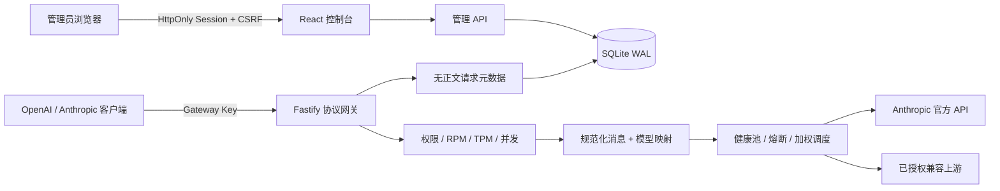

# Claude Web2

一个面向**已授权 Claude API 上游**的双协议 AI 网关与可视化控制台。它对外同时提供 OpenAI Chat Completions 与 Anthropic Messages 风格接口，负责模型别名、密钥权限、流式协议转换、健康调度、限流和审计。

Windows、Mac、本地 Linux 和服务器容器运行的是同一个 Web 应用，不需要安装桌面客户端：本机用浏览器打开回环地址，服务器部署则通过 HTTPS 域名访问完整控制台。

> 本项目不是 `claude.ai` 网页逆向工具。它不提取或注入第三方 Cookie/sessionKey，不仿冒 OAuth 身份，不绕过 CAPTCHA、Cloudflare 或 TLS 指纹，也不通过账号轮换规避服务额度。请使用 Anthropic 官方 API Key 或你被明确授权使用的兼容上游。

[English documentation](README.en.md)

## 能做什么

- 同时暴露 `/v1/chat/completions`、`/v1/messages`、`/v1/messages/count_tokens` 与 `/v1/models`。
- OpenAI/Anthropic/双模式网关 Key；只保存 HMAC，不保存可还原明文，创建时仅显示一次。
- 文本、图片、文档、工具调用、thinking、结构化输出、prompt caching 扩展块和 SSE 流式转换。
- 多个**合规 API 上游**按优先级、权重、当前负载和健康状态调度；重试只发生在流首字节发出前。
- RPM、TPM、并发、模型白名单、IP 白名单、到期和撤销控制。
- 模型级输入/输出价格、请求成本追踪和 API Key UTC 每日美元预算；流量进入上游前先预留预算，完成后按实际 usage 结算。
- React 管理控制台：总览、Playground、密钥、上游、模型、请求元数据、审计和全部运行策略。
- 管理员可在控制台轮换本地密码；成功后自动撤销同账号的其他会话。
- 标准 OIDC Authorization Code + PKCE 管理员登录，支持组白名单、显式账号绑定和可选自动建号。
- SQLite WAL；AES-256-GCM 凭据加密、Argon2id 管理员密码、HttpOnly 会话、独立 CSRF 令牌和 SSRF 防护。
- 不记录提示词、回复正文、附件、工具参数或原始密钥。

## 架构



## 快速开始

要求 Node.js 24+。同一组命令适用于 Windows PowerShell、macOS Terminal 和 Linux Shell，不依赖 `cp`、Bash 或 PowerShell 专属脚本。

```bash
npm ci
npm run setup
```

安装器会创建 `.env`、随机生成主密钥与首次管理员密码，并把密码显示一次。保存密码后执行：

```bash
npm run local
```

`npm run local` 会自动检查配置、在源码有变化时构建生产版 React Web 控制台，然后启动服务。打开 `http://127.0.0.1:8787`。登录后依次创建上游、模型映射和网关 Key。数据库首次建好后，可以从运行环境移除 `CW2_ADMIN_PASSWORD`；`CW2_MASTER_KEY` 必须稳定保存，否则已有加密凭据无法解密。

Windows、Intel/Apple Silicon Mac 和本地 Linux 都不需要 Docker。首次执行 `npm ci` 后，以后通常只需 `npm run local`；仍可使用 `npm run doctor && npm run build && npm start` 分步运行。

已存在 `.env` 时安装器默认拒绝覆盖；只有明确需要重建配置时才使用 `npm run setup -- --force`。完整的平台、容器、HTTPS 反代和升级说明见 [部署指南](docs/DEPLOYMENT.md)。

开发模式：

```bash
npm run dev
```

## Docker Compose

先用跨平台安装器准备 `.env`，再构建并启动：

```bash
npm run setup
docker compose config
docker compose up -d --build
```

Compose 默认只映射到宿主机 `127.0.0.1:8787`。Dockerfile 不固定 CPU 平台，可在 Docker 支持的 Intel/AMD 64 位或 ARM64 Mac/Linux 主机上构建本机架构镜像。容器使用非 root 用户、只读根文件系统、移除 Linux capabilities，并把数据库放在命名卷 `claude-web2-data`。生产环境建议由 Caddy、Nginx 或同类反向代理终止 HTTPS。

只有在防火墙或可信 HTTPS 入口已经就绪时，才把 `CW2_BIND_ADDRESS` 改成 `0.0.0.0`；正常的同机反向代理部署应继续使用默认回环地址。

备份前可短暂停止服务，然后备份命名卷；或在运行中使用 SQLite 的在线备份工具。不要只复制主 `.db` 而忽略仍在使用的 WAL 文件。

本机或运行中的容器都可以使用内置的在线备份器：

```bash
npm run backup
npm run backup -- --verify data/backups/claude-web2-REPLACE.db
```

备份器会调用 SQLite Online Backup API、执行 `quick_check`、验证 Claude Web2 核心表，并生成 SHA-256 清单。备份包含加密后的上游凭据与密码哈希，仍需私密保存；主密钥不会写入备份，恢复时必须配套保留原 `CW2_MASTER_KEY`。

## 环境变量

| 变量 | 默认值 | 说明 |
|---|---:|---|
| `CW2_MASTER_KEY` | 必填 | `base64:` 或 `hex:` 开头，解码后恰好 32 字节。 |
| `CW2_ADMIN_PASSWORD` | 首次必填 | 新数据库的初始管理员密码，至少 12 位。 |
| `CW2_ADMIN_USERNAME` | `admin` | 初始管理员用户名。 |
| `CW2_HOST` | `127.0.0.1` | 监听地址；容器内覆盖为 `0.0.0.0`。 |
| `CW2_PORT` | `8787` | HTTP 端口。 |
| `CW2_DATA_DIR` | `./data` | SQLite 与运行数据目录。 |
| `CW2_BIND_ADDRESS` | `127.0.0.1` | 仅供 Compose 使用的宿主机发布地址；不是后端监听配置。 |
| `CW2_TRUST_PROXY` | `false` | 仅在可信反代后设为 `true`。 |
| `CW2_SECURE_COOKIES` | `auto` | `true`、`false` 或根据公开 URL/监听地址自动判断。 |
| `CW2_ALLOWED_ORIGINS` | 空 | 额外允许的浏览器 Origin，逗号分隔。 |
| `CW2_PUBLIC_URL` | 空 | OIDC 必需的外部 Origin，例如 `https://gateway.example.com`；不能带路径。 |
| `CW2_LOG_LEVEL` | `info` | Fastify/Pino 日志级别。 |

## 上游与模型

`anthropic` 上游固定只允许 `https://api.anthropic.com`，使用 `x-api-key`。`compatible` 上游可选择 `x-api-key` 或 Bearer，但必须是解析到公网地址的 HTTPS URL；重定向、私网/保留地址、URL 内嵌凭据均被拒绝。

模型别名把公开模型 ID 映射为真实上游模型，可选绑定一个固定上游。未绑定时由健康池选择满足优先级与并发约束的上游。

模型映射中的价格由管理员按实际上游账单填写，单位为 USD / 百万 Token。它只用于本地估算与预算控制，不会自动同步供应商价格；价格设为 `0` 的模型不会消耗成本预算。每日预算按 UTC 自然日重置，非流式和正常结束的流式响应按上游返回的实际 usage 入账。

## 调用示例

OpenAI 风格 Key：

```bash
curl -N http://127.0.0.1:8787/v1/chat/completions \
  -H "Authorization: Bearer gw-oai_REPLACE_ME" \
  -H "Content-Type: application/json" \
  -d '{"model":"claude-default","stream":true,"messages":[{"role":"user","content":"Hello"}]}'
```

Anthropic 风格 Key：

```bash
curl -N http://127.0.0.1:8787/v1/messages \
  -H "x-api-key: gw-ant_REPLACE_ME" \
  -H "anthropic-version: 2023-06-01" \
  -H "Content-Type: application/json" \
  -d '{"model":"claude-default","max_tokens":256,"stream":true,"messages":[{"role":"user","content":"Hello"}]}'
```

双模式 Key 可使用任一鉴权头，但服务仍会按请求端点校验 Key 模式。

## OIDC 管理员登录

1. 设置外部 HTTPS Origin：`CW2_PUBLIC_URL=https://gateway.example.com`。
2. 在身份提供商登记回调：`https://gateway.example.com/api/admin/v1/oidc/callback`。
3. 用密码管理员进入“系统设置 → OIDC 单点登录”，填写 issuer、Client ID/Secret、scope 与 claim。
4. 先保存并测试 Discovery。关闭自动建号时，点击“绑定当前管理员”完成首次身份绑定。
5. 建议设置精确的允许组；自动建号开启时尤其如此。

安全约束包括：公开 HTTPS Discovery/JWKS/token 端点、禁止重定向、固定 S256 PKCE、一次性 state、浏览器事务绑定、nonce、短时流程、ID Token 签名/issuer/audience/azp/时效校验，以及仅允许 RS256、PS256、ES256、EdDSA。OIDC Client Secret 使用与上游凭据相同的记录级 AES-GCM 加密，但不同 AAD。

## 安全运维

- 把 `CW2_MASTER_KEY` 放入 Secret Manager，不要提交到 Git、镜像或日志。
- 在生产环境使用 HTTPS，并确认 `CW2_SECURE_COOKIES=true`（有 `CW2_PUBLIC_URL=https://...` 时 `auto` 会启用）。
- 只有在你完全信任且正确配置反代的情况下启用 `CW2_TRUST_PROXY`。
- 为网关 Key 使用最小模型/IP/速率/并发权限，定期轮换和撤销。
- 定期在“系统设置”轮换本地管理员密码；OIDC 自动建号账户默认没有可用的本地密码。
- 请求日志只保存协议、模型、Token 数、延迟、状态和关联 ID；仍应按组织要求设置保留期和访问控制。
- `/health/live` 只表示进程存活，`/health/ready` 同时检查数据库。

## 质量检查

```bash
npm run doctor
npm run typecheck
npm test
npm run build
```

当前实现是面向单实例的 SQLite 部署。若需要多节点水平扩容，应先把会话、限流计数、调度状态和数据库迁移到共享且具备事务语义的基础设施。

仓库的 CI 会在 Windows、macOS、Ubuntu 的 Node.js 24 环境执行上述检查，并用 Buildx 分别构建 `linux/amd64` 与 `linux/arm64` 容器镜像。
